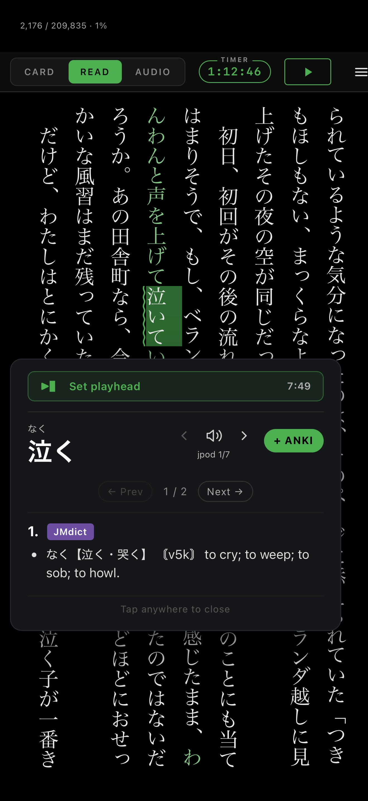
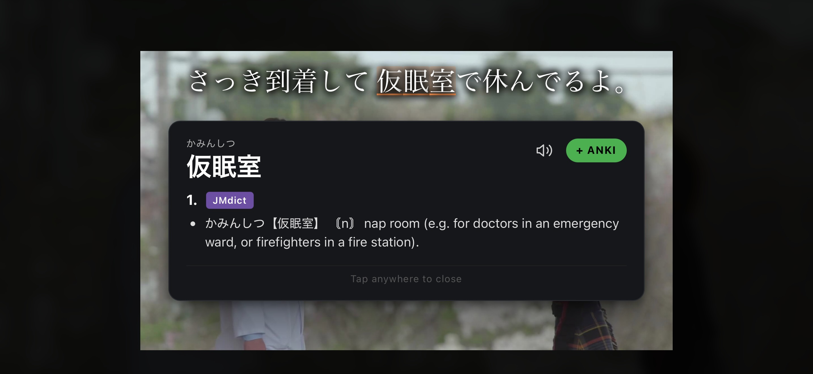
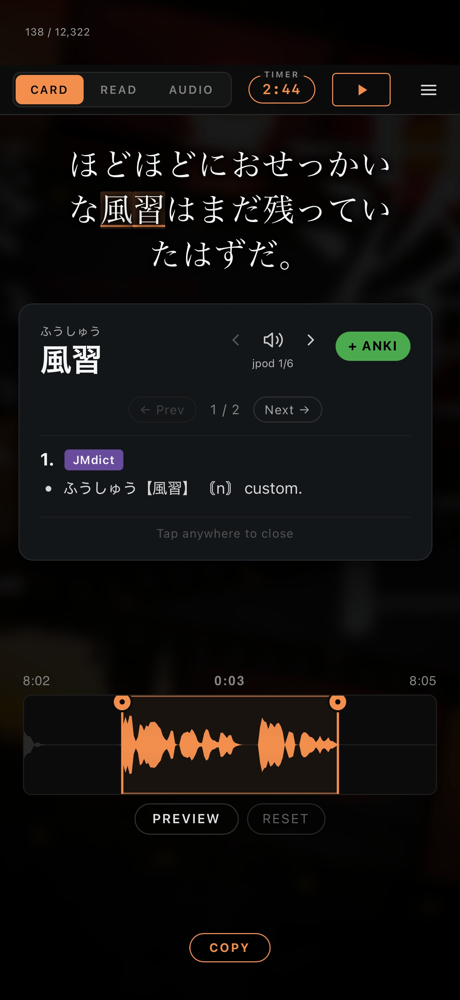
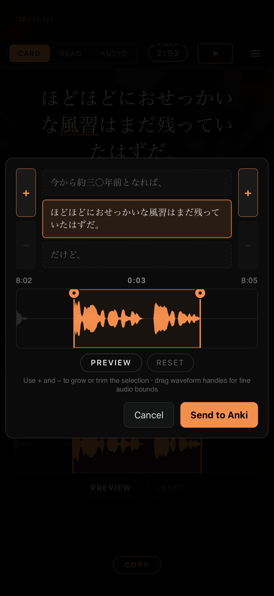
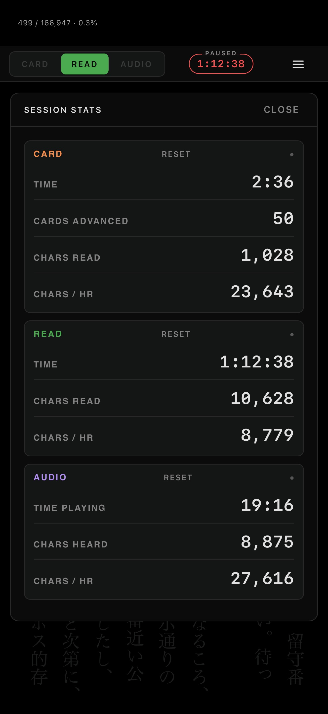

<h1 align="center">Kadoki</h1>

  A cross-platform app for <strong>narrated reading with epub/audiobook/SRT</strong> and <strong>viewing subs2srs-generated anki decks</strong>, with <strong>dictionary lookup</strong> and <strong>Anki integration</strong>.

  <a href="../../releases/latest"><strong>⬇ Download the latest APK</strong></a> ·
  <a href="CHANGELOG.md">Changelog</a>

  

Unlike browser-script workflows, Kadoki is **fully integrated**. No plugins, browser extensions, AnkiConnect, or experimental browsers are required.

---

## Main Features

Kadoki supports two primary workflows.

### 1. Narrated Reading

Read narrated books using:

- epub
- audiobook files (`mp3`, `m4a`, and chaptered Audible-style `m4b`)
- SRT subtitles generated by [SubPlz](https://github.com/kanjieater/SubPlz)

All reading modes stay perfectly synchronized while supporting full dictionary lookup and Anki integration.

**Core features**

- Instant recall of previously loaded media
- Integrated audio navigation controls
- Gesture-based interaction
- Local audio archive support
- Full Yomitan dictionary compatibility
- Native Anki integration on both Android and iOS

### 2. Subs2srs / Anki Deck Playback

Kadoki can also open Anki decks created with subs2srs. These decks play card-by-card with images, audio, subtitle text, dictionary lookup, and Anki integration — similar to reading a voiced manga or visual novel.

When opening an Anki deck, Kadoki automatically enters **Card Mode**.

  

---

## Reading Modes

### Card Mode（カード）

Each subtitle line becomes a "card" for shadowing and reading practice.

- Waveform display
- Adjustable subtitle margins
- Quick Anki export
- Fast navigation between subtitle lines

| Gesture | Action |
| --- | --- |
| Swipe **down** | Repeat card audio |
| Swipe **up** | Send card to Anki |
| Swipe **left / right** | Next / previous card |

Ideal for shadowing, pronunciation practice, reading fluency, and sentence mining.

  

### Reading Mode（読書）

A full epub reader designed specifically for narrated reading.

- Rubber-band page kinetics
- Quick dictionary access
- Audio synchronization
- Flexible playhead control

| Gesture | Action |
| --- | --- |
| Swipe **down** | Play / pause audio |
| **Tap** a word | Open dictionary → "Set Playhead" |

The rubber-band scrolling system lets you temporarily explore nearby lines without permanently losing your reading position. To keep the explored position visible until the next automatic page-follow, tap with another finger while scrolling.

### Audio Mode（聞く）

Listen to the audiobook while staying synchronized with the reading modes.

- Background playback
- Continuous listening statistics
- Sync with reading progress
- Lock-screen subtitles — the current sentence shows large on the lock screen / Always-On Display while you listen (iOS)

Audio keeps playing as you switch between Card, Read, and Audio, and every view stays locked to the same playhead — so you can freely alternate between intensive reading and passive listening without ever stopping playback. To jump back to where you were reading before you started listening, use **Bookmarks** (in the hamburger menu): each time you switch into Audio, Kadoki quietly saves your last reading spot.

  

---

## Bookmarks

Each time you switch from Card or Read into **Audio**, Kadoki silently saves the spot you were on. The hamburger menu's **Bookmarks** keeps your last few spots (spaced about a minute apart) — tap one to jump straight back to that mode and exact position. A Read-mode bookmark briefly flashes the line you'd reached so it's easy to find.

---

## Getting Started

After installing the app:

1. Import dictionaries
2. Import media
3. Configure Anki integration

Optional: install the local audio archive.

### Audio Archive Formats

| Platform | Supported formats |
| --- | --- |
| iOS | `.tar` (must be decompressed first) |
| Android | `.tar`, `.tar.xz` |

---

## Toolbar

Tap any empty space to show or hide the toolbar.

- **Top left** — mode switching: Card / Read / Audio
- **Location indicator** — changes with the active mode; tap it to jump to a specific location
- **Timer** — tap to pause/resume timing; includes intelligent auto-timeout logic for accuracy (and a slight scroll in Read mode resumes it automatically)
- **Top right menu** (hamburger) — Library · Stats · Bookmarks · Playback Speed · Print · Preferences

---

## Library

Each Library entry is called a **Title**. A Title may contain:

- An Anki deck (Card mode), or
- A book — **EPUB** or plain-text **`.txt`** — for Read mode, optionally paired with an audiobook + SRT for synchronized narration, or
- Just an **audiobook + SRT** (no book) — enables Card and Audio modes (Read is hidden)

Features: custom cover image support · one-tap activation · swipe-to-edit · swipe-to-delete.

### Import a folder

**Library → 📁 Import folder** bulk-imports a whole folder of books in one step. The folder can either hold a single book's `epub` / audio / `srt`, or contain many such sub-folders — each book becomes its own Title, with the epub automatically paired to its matching audio and subtitles by filename. Files are **linked, not copied**, so even a large library imports instantly; each book's media is pulled into the cache the first time you open it, and re-importing skips books already in your library. Embedded cover art (the epub cover image or the audio file's tag) is filled in shortly after import.

A Title that contains a book (**EPUB** or **`.txt`**) opens directly in **Read** mode.

To use Kadoki as a standard epub reader, simply load an epub into a Title. However, it is not optimized for epub only reading, and Hoshi reader has much more mature support.

---

## Playback Speed

Playback speed can be configured globally across all modes, or separately for each mode. Playback speed is **not** stored per title.

---

## Preferences

- **Per-mode appearance** (Card / Read / Audio): font size, **font family — including your own imported TTF/OTF fonts**, and toggles for the card background image, the waveform, and an upcoming-subtitle preview
- Mode color customization
- Dictionary import
- Audio archive import
- Anki configuration

---

## Anki Integration

Kadoki uses the native Anki apps directly — no AnkiConnect or external connectors required.

| Platform | App |
| --- | --- |
| iOS | AnkiMobile (paid) |
| Android | AnkiDroid (free) |

At present, deck names, note types, and field mappings must be configured manually.

### Swipe-Up Save (Card Mode)

Quickly save an entire subtitle card. Available fields:

- Expression
- Image
- Sentence audio

Useful for shadowing, reading fluency practice, and sentence review.

### Dictionary Add Word

Words can be added to Anki directly from the dictionary in any mode. Supported fields:

- Term
- Reading
- Sentence
- Meaning
- Image
- Sentence audio
- Term audio
- **Glossary** *(optional)* — the full multi-sense definition HTML (numbered senses, part-of-speech + dictionary pills, gloss list), identical to the in-app dictionary popup
- **Furigana** *(optional)* — per-kanji ruby over the headword

The two optional fields are off by default; map them in Preferences (and add matching fields to your note type) for a card that mirrors the in-app dictionary popup. A ready-to-paste, Kadoki-styled card template is provided.

**Audio support.** For narrated audiobooks, context audio boundaries can be adjusted before export. If the local audio archive is installed, native pronunciation audio can also be added automatically.

  

---

## Dictionary System

Kadoki supports multiple dictionaries simultaneously.

- Adjustable dictionary ordering
- Dictionary switching
- Multiple pronunciation sources
- Automatic playback pause/resume

When the dictionary is open, narration pauses automatically and resumes when dismissed, and accidental word re-selection is blocked. Dismiss the dictionary by tapping anywhere outside it.

---

## Statistics

Detailed statistics including time spent reading, characters read, and characters listened to per hour.

**Character counting.** Counts use the Japanese-only standard from [TTU Reader](https://github.com/ttu-ttu/ebook-reader) — only kana, kanji, and ideographs are counted; punctuation, whitespace, Latin text, and furigana (ruby) are excluded. The same rule applies across **all three modes** (Read, Card, Audio), so the book total, the location indicator, and chars/hr are directly comparable to each other and to the desktop TTU reader. (A book may therefore report a noticeably lower total than its raw character count — e.g. ~201k rather than ~223k — because punctuation and spacing are not counted.)

  

---

## Acknowledgements

Kadoki would not be possible without the work of many projects in the Japanese learning community:

- [Yomitan](https://github.com/yomidevs/yomitan)
- [ttu-whispersync](https://github.com/Renji-XD/ttu-whispersync)
- [TTU Reader (ebook-reader)](https://github.com/ttu-ttu/ebook-reader)
- [Jidoujisho](https://github.com/arianneorpilla/jidoujisho)
- [Hoshi Reader](https://github.com/Manhhao/Hoshi-Reader)
- [Manatan](https://github.com/KolbyML/Manatan)
- [SubPlz](https://github.com/kanjieater/SubPlz)

---

## License

Kadoki is released under the [GNU General Public License v3.0](LICENSE).

Copyright © 2026 helica1. This is free software: you may redistribute and modify it under the terms of the GPLv3. It comes with **no warranty**. Any distributed derivative work must also be licensed under the GPLv3.
