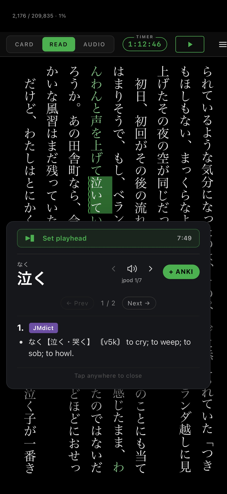
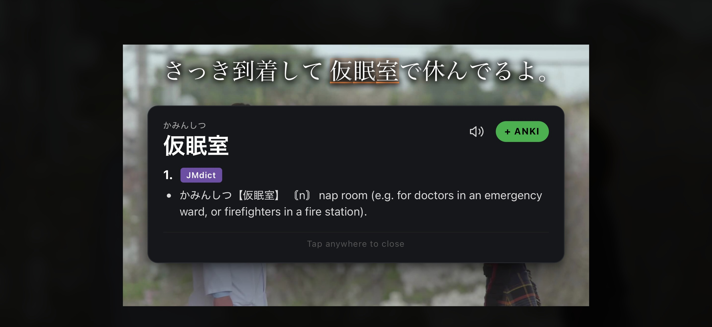
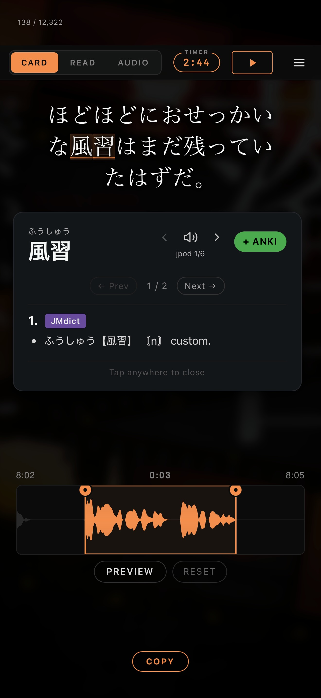
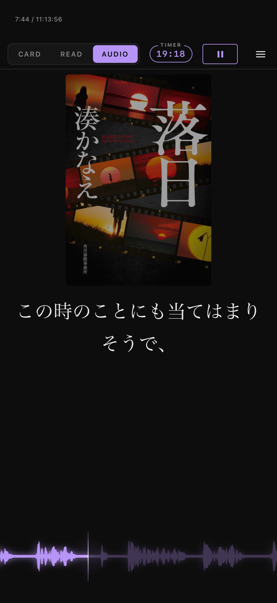
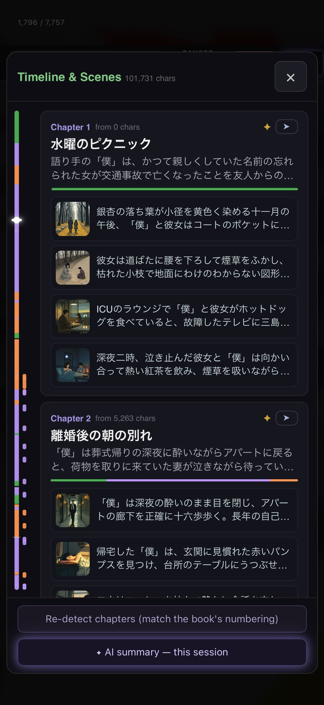
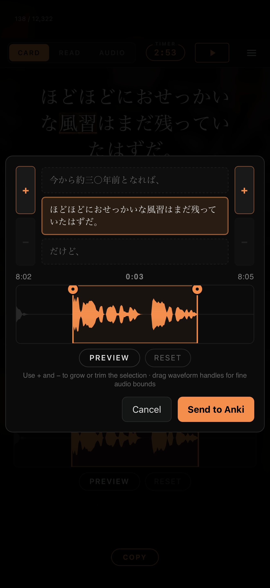
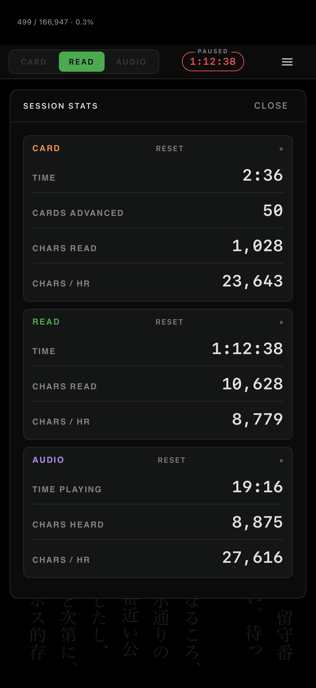

<h1 align="center">Kadoki</h1>

  A cross-platform app for <strong>narrated reading with epub + audiobook</strong> — subtitles are generated and matched on device, <strong>no SRT files needed</strong> — and <strong>viewing subs2srs-generated anki decks</strong>, with <strong>dictionary lookup</strong> and <strong>Anki integration</strong>.

  <a href="../../releases/latest"><strong>⬇ Download the latest APK</strong></a> 

  <a href=https://testflight.apple.com/join/SpY7rqgR><strong>iOS from TestFlight</strong></a> 

  

Unlike browser-script workflows, Kadoki is **fully integrated**. No plugins, browser extensions, AnkiConnect, or experimental browsers are required.

---

## What's new in 1.6.6

The biggest update since the AI companion: **on-device subtitle generation and book sync, on both platforms**. SRT files are no longer needed — and results are actually better without them. A book + audiobook pair is transcribed on device in real time and matched to the book's own text; an audiobook alone gets natively generated subtitles. Generated lines carry word-level timing (karaoke highlighting, precise Anki audio clips) that pre-made SRTs don't have. No more preprocessing with SubPlz; existing SRTs remain fully supported.

Beyond that, both platforms get karaoke-style highlighting, a dictionary lookup history, and per-title statistics — and iOS gains a full **Apple Watch app**.

**On both platforms:**

- **Karaoke word highlighting:** the old block-style green/orange line highlights are gone. In every mode the narration now lights up word by word — a soft glow sweeps the current word (in each mode's accent color) while a subtle pill marks the phrase about to be spoken, segmented with the dictionary so katakana and kanji words alike chunk naturally.
- **Dictionary lookup history:** every word you look up is logged with the sentence around it. Open **Lookup history** from the menu to step back through past lookups in a split view — context on top (with the exact timestamp and position), full dictionary below — and send any of them to Anki with audio, without ever moving your place in the book.
- **Per-title statistics:** swipe a title left in the library and tap **Stats** for that book's own picture: when you started, progress and reading pace, estimated time to finish, a 14-day activity chart, and time spent per mode.
- **Read/unread markers in the AI companion:** Timeline and Scenes entries now work like an inbox — unread items are bold with a blue dot, a 続きから pill marks where you left off, and read items show a dim ✓.
- **Smoother read-along:** read mode's auto-follow no longer stalls; a native-truth watchdog keeps the highlight flowing even when the app is under load.
- **More tactile UI:** iOS-style rounded swipe buttons, spring feedback, and haptics across the menus.
- **Subtitles generated an hour ahead** for audio-only titles, so a long walk never outruns them.

**iOS:**

- **Apple Watch companion app.** Send any audiobook to the watch and listen **entirely phone-free** — through the watch speaker or Bluetooth headphones — with live karaoke subtitles on the wrist, cover-art player, and the same gestures as the phone (tap or swipe down to play/pause, left/right to step subtitles). Positions sync both ways automatically (freshest listen wins — walk with the watch, come home, and the phone is already at the right spot), watch listening time appears in Stats as its own category, and swiping up **flags the current subtitle** so it lands in the phone's lookup history ready to study and send to Anki. Watch-face complications show the current book and progress.

**Android:**

- **On-device subtitle generation (whisper).** Audiobooks with no subtitle file now transcribe themselves right on the phone, just like on iOS: live Japanese subtitles with word-level karaoke timing appear as you listen, card mode unlocks for audio-only titles, and everything works offline. The speech model (~190 MB) downloads once inside the app after you confirm — nothing is bundled into the APK. Subtitle boundaries are snapped to the actual speech energy, so audio clips sent to Anki start and end cleanly. Requires a 64-bit device (any modern phone).
- Everything in the shared list above — karaoke highlighting, lookup history, per-title stats, AI read markers — arrives on Android in this release (Android's last release was 1.6.0).

---

## What's new in 1.6.4

Fixes and refinements since 1.6.3:

- **Listening sessions survive switching to another audio app:** playing something else (e.g. YouTube Music) while Kadoki sat paused in the background could throw the audiobook back hours once Android reclaimed the app — and the lost session never even appeared in History. The playhead is now restored from the audio engine's own durable record, positions you deliberately chose are never overridden, and background listens are recorded in History.
- **Audio stats no longer double-count:** listening characters read roughly double their true value — reading-along minutes were credited to both Read and Audio, and seeking could count skipped audio as heard. Every character now counts once, in the mode you consumed it, so chars/hour reflects the real narration pace.
- **AI chapter summaries recover on their own:** one failed chapter no longer wedges every later chapter at "Waiting…". Temporary failures (rate limits, network drops, malformed responses) retry automatically with backoff — bounded, so retries can never burn through API credits — while unrecoverable ones (invalid key, out of credits) are skipped past and stay tappable to retry. Books that were already stuck unstick on their next open.
- **The ☰ menu works again:** after using any menu item once, the next opened menu silently closed itself on the first touch (both platforms) — which also made it impossible to scroll. It now stays open and scrolls when taller than the screen, e.g. in landscape.
- **Stats panel is reachable:** the Close button no longer hides beneath the top bar. The panel is sized to ~85% of the screen with a pinned header, and tapping anywhere outside dismisses it.
- **Dictionary send-to-Anki no longer reports "Failed" when it worked:** every successful send flashed a red Failed button even as the note landed in Anki.
- **Character images queue instead of failing:** requesting a second image while one is generating now queues it in order (it previously showed "Failed" even though the request was accepted).
- **Card mode in landscape uses the full screen height:** the card image no longer reserves blank space for the top bar — the bar overlays instead.
- **"Repeat Chapter" label no longer renders green** on first open of the audio view.
- **iOS: precise audio slices on VBR MP3 audiobooks:** Anki clips and waveform windows could land minutes away from the intended line on long variable-bitrate files; they now hit the exact cue.

---

## What's new in 1.6.3

Fixes and refinements since 1.6.2:

- **Faster reopens:** returning to a title you've opened before skips the "re-indexing" pause — the subtitle parse (subs2srs / card titles) and the EPUB page render (text-only books) are cached, so the book comes straight back up.
- **AI companion — no more garbled output with OpenRouter models:** chapter summaries, the Timeline, Characters, and Scenes now generate reliably on reasoning models such as DeepSeek. The model's internal "thinking" no longer bleeds into the result, and a half-formed response is recovered instead of failing the whole chapter.
- **History is now per-title:** the History list shows only your recent sessions in the book you're currently in, rather than a global list mixing every title.
- **Position safety (continued):** while a title is still loading, its place can no longer be written onto — or inherited from — the title you just left. This closes the remaining window where a fast title switch could cross-contaminate reading position, bookmarks, and the furthest-listened mark.
- **New "AI material" time in Stats:** time spent on the Characters, Timeline, and Scenes pages is tracked as its own category (today and yesterday), so browsing them no longer counts as reading time.

---

## What's new in 1.6.2

Fixes and refinements since 1.6.1:

- **Position safety:** switching titles no longer lets a new title inherit the previous one's reading position.
- **Listening stats:** audio mode no longer over-counts characters read (was roughly double).
- **Character furigana:** name readings are now orange and tied to each kanji — using the book's own ruby as the source of truth — like the dictionary popup.
- **Anki — add duplicates (iOS):** you can now send a card for a word that's already in your collection (AnkiMobile no longer rejects it).
- **Dictionary popup:** the +Anki and audio buttons respond on the first tap, and the definition no longer goes missing when a looked-up word crosses a column.
- **Scenes:** scene audio clips anchor to the correct passage far more reliably; the clip editor responds on the first tap; and its controls are now a single ▶ / ❚❚ play-pause toggle (matching scene playback).
- **Scene prompt editing:** the regenerate prompt box is larger and no longer closes while you're typing.
- **Polish:** larger, cleaner close (✕) on the character popup; removed a glow that could clip off the edge of the menu button.

---

## Main Features

Kadoki supports two primary workflows.

### 1. Narrated Reading

Read narrated books using:

- epub (or plain-text `.txt`)
- audiobook files (`mp3`, `m4a`, and chaptered Audible-style `m4b`)

**Subtitle files are not needed — on either platform.** Pair a book with its audiobook and Kadoki transcribes the narration on device in real time, **matching each line to the book's own text** as you listen. An audiobook with no book at all gets natively generated subtitles instead. This actually works *better* than pre-made subtitles: generated lines carry word-level timing, which powers the karaoke highlight and cleanly clipped Anki audio. There is no need to preprocess anything with [SubPlz](https://github.com/kanjieater/SubPlz) — though if you already have SRT files, they are still fully supported.

All reading modes stay perfectly synchronized while supporting full dictionary lookup and Anki integration.

**Core features**

- Instant recall of previously loaded media
- Integrated audio navigation controls
- Gesture-based interaction
- Local audio archive support
- Full Yomitan dictionary compatibility
- Native Anki integration on both Android and iOS

### 2. Subs2srs / Anki Deck Playback

Kadoki can also open Anki decks created with subs2srs. These decks play card-by-card with images, audio, subtitle text, dictionary lookup, and Anki integration — similar to reading a voiced manga or visual novel.

When opening an Anki deck, Kadoki automatically enters **Card Mode**.

  

---

## Reading Modes

### Card Mode（カード）

Each subtitle line becomes a "card" for shadowing and reading practice.

- Waveform display
- Adjustable subtitle margins
- Quick Anki export
- Fast navigation between subtitle lines

| Gesture | Action |
| --- | --- |
| Swipe **down** | Repeat card audio |
| Swipe **up** | Send card to Anki |
| Swipe **left / right** | Next / previous card |

Ideal for shadowing, pronunciation practice, reading fluency, and sentence mining.

  

### Reading Mode（読書）

A full epub reader designed specifically for narrated reading.

- Rubber-band page kinetics
- Quick dictionary access
- Audio synchronization
- Flexible playhead control
- **Inline images** — covers, illustrations, and image pages render in the page flow; **double-tap** any image for a full-screen viewer with pinch-zoom and a **◑ Invert** button
- **Line-art inversion for dark mode** *(optional)* — ink drawings and scanned text pages render white-on-black; grayscale and color artwork is detected automatically and keeps its original look
- Polished vertical-text typography — furigana is never clipped at page edges, and page turns land in one smooth motion

| Gesture | Action |
| --- | --- |
| Swipe **left / right** (top ⅔) | Previous / next subtitle\* |
| Swipe **left / right** (bottom ⅓) | Turn page |
| Swipe **down** | Play / pause audio |
| **Tap** a word | Open dictionary → "Set Playhead" |

\*Subtitle navigation applies to audiobook + subtitle titles; EPUB-only books turn the page on any horizontal swipe.

The rubber-band scrolling system lets you temporarily explore nearby lines without permanently losing your reading position. To keep the explored position visible until the next automatic page-follow, tap with another finger while scrolling.

### Audio Mode（聴く）

Listen to the audiobook while staying synchronized with the reading modes.

- Background playback
- Continuous listening statistics
- Sync with reading progress
- Jump to any time — tap the top-left location indicator and enter `mm:ss`, `h:mm:ss`, hours (`1h23`), seconds, or a percentage
- **Chapter Repeat** — toggle it on to have each chapter replay once before moving on, with a short spoken Japanese cue at the boundary, and a "next chapter" button to skip the replay. Works with the screen off — ideal for intensive listening.
- Reliable interruptions — phone calls pause playback cleanly (short interruptions resume by themselves), and playback recovers automatically if the system clears the cached audio while backgrounded
- Lock-screen subtitles — the current sentence shows large on the lock screen / Always-On Display while you listen (optional — turn it off in Preferences to show the book cover instead and save battery)
- Efficient screen-off listening — overnight sessions do minimal background work
- **No subtitles? Kadoki makes them** — audiobooks without an SRT are transcribed on-device (iOS 26+ / Android 64-bit) with word-level karaoke timing, staying about an hour ahead of the playhead; once the whole book is covered it becomes a normal subtitled title with card mode and Anki export

Audio keeps playing as you switch between Card, Read, and Audio, and every view stays locked to the same playhead — so you can freely alternate between intensive reading and passive listening without ever stopping playback. To jump back to where you were reading before you started listening, use **Bookmarks** (in the hamburger menu): each time you switch into Audio, Kadoki quietly saves your last reading spot.

  

---

## Bookmarks

Each time you switch from Card or Read into **Audio**, Kadoki silently saves the spot you were on. The hamburger menu's **Bookmarks** keeps your last few spots (spaced about a minute apart) — tap one to jump straight back to that mode and exact position. A Read-mode bookmark briefly flashes the line you'd reached so it's easy to find.

---

## History

The hamburger menu's **History** lists your most recent reading, listening, and card sessions by mode — tap any entry to jump straight back to that spot.

---

## AI Reading Companion *(optional · bring-your-own-key)*

Kadoki can build a **spoiler-safe** companion to whatever you're reading or listening to, powered by **your own AI API keys**. Everything is generated **only up to your current position**, so it never reveals what you haven't reached yet. There are three components:

  

**1. Timeline & Scenes** *(pictured above)* — a chapter-by-chapter map of the story. Each chapter gets a concise summary, its key events, and a set of **Scenes** — the most illustration-worthy moments, picked by the AI, shown chronologically with thumbnails and linked back to the exact sentence (and, in an audiobook, the matching audio). A glowing marker tracks your live position; a second track shows sections you've re-read or re-listened. Very long chapters are split into roughly even parts.

**2. Characters** — the cast is detected automatically as it appears, each with a description, role, and a running list of developments. View them two ways: tap a name in **any mode** for a quick **pop-up** (turn on the optional wavy underline to mark character names right in the text), or open the dedicated **Characters** menu for the full roster — collapsible entries, sortable by recency / prominence / first appearance, with furigana on every name.

**3. AI images** — generate artwork for both **Scenes and Characters** using your choice of image models on **[fal.ai](https://fal.ai)** (e.g. FLUX) — **bring your own fal.ai API key**. Generate on demand from a character or scene, or turn on **Auto-illustrate scenes** to have them created in the background as you read. Every image's prompt is editable, so you can tweak and regenerate.

Both the text companion and the images are **bring-your-own-key**: the timeline, characters, and scene ideas use **your own [Claude (Anthropic)](https://www.anthropic.com) API key**, and images use **your own fal.ai key**. Keys live only on your device, and the features stay off until you add one. A red dot on **Characters** and **Timeline & Scenes** in the menu appears when a new chapter has been analyzed.

> Summaries, character notes, and captions are written in Japanese (it's a Japanese-learning app). The **interface** language is independent — see [Language](#language).

### AI Setup

Kadoki is **bring-your-own-key (BYOK)**: you use your own API accounts and keys are stored only on your device. The AI features stay off until you add a key.

**1. Text — Claude (powers the timeline, characters, and scene ideas)**

1. Create an Anthropic API key at **console.anthropic.com**.
2. **Preferences → AI Features**, paste the key, and choose a quality tier:
   - **Economy (Haiku)** — fastest and cheapest (≈ $0.50 / book)
   - **Standard (Sonnet)** — balanced
   - **Premium (Opus)** — highest quality
3. Open a book or audiobook and read/listen — chapters are analyzed in the background as you reach them. You can also tap a chapter to (re)generate it.

**2. Images — fal.ai (powers character & scene pictures)** *(optional)*

1. Create a key at **fal.ai/dashboard/keys** (no identity verification required).
2. **Preferences → AI Image**, paste the fal.ai key, and pick a model (FLUX is the default — fast and uncensored).
3. Generate from the **Characters** screen or a scene's detail view. Turn on **Auto-illustrate scenes** to have pictures created in the background as you read (paced so it never floods the server), or generate on demand.

**3. Alternative backend — OpenRouter** *(optional · one key, hundreds of models)*

Prefer a single key with access to many models — often far cheaper? Kadoki also supports **[OpenRouter](https://openrouter.ai)** for both text and images.

- **Text:** **Preferences → AI Features → Backend: OpenRouter**, paste your OpenRouter key, then tap **Choose model…** for a live, searchable list showing each model's per-token cost. Budget models such as **DeepSeek V3.2** analyze a whole chapter for a fraction of a cent.
- **Images:** **Preferences → AI Image → Backend: OpenRouter** to choose from its image models (FLUX, Gemini, and more). Models that bill per image (like FLUX) are labelled as such. *After switching, re-select your image model once so its settings are saved.*

The model used is shown in small text **under each generated image** and **at the end of each summary**.

Image prompts are written by your text model (Claude by default) from each character/scene; edit any prompt before regenerating. Estimated text and image API usage for the month is shown in the settings.

---

## Google Drive Sync *(optional)*

Sync a title across your devices through **your own** Google Drive — the dynamic timeline, character cards (including images), processing progress, AI settings, and your exact reading/listening position. After connecting, use **Sync** in the title menu; it's bidirectional and fast. The first sync of a title asks once whether to also move the source files (epub / SRT / audiobook); after that only the lightweight state syncs. **Manage Drive Files** (menu) lists, uploads, and deletes synced titles.

Setup uses a Google OAuth client ID from your own Google Cloud project (Drive API enabled, `drive.file` scope). Enter it in **Preferences → Google Drive sync** and connect — on the consent screen, keep the Drive permission **checked**.

---

## Getting Started

After installing the app:

1. Import dictionaries
2. Import media
3. Configure Anki integration

Optional: install the local audio archive.

### Audio Archive Formats

| Platform | Supported formats |
| --- | --- |
| iOS | `.tar` (must be decompressed first) |
| Android | `.tar`, `.tar.xz` |

---

## Toolbar

Tap any empty space to show or hide the toolbar.

- **Top left** — mode switching: Card / Read / Audio
- **Location indicator** — changes with the active mode; tap it to jump to a specific location (card number, reading position, or audio time)
- **Timer** — tap to pause/resume timing; includes intelligent auto-timeout logic for accuracy (and a slight scroll in Read mode resumes it automatically)
- **Top right menu** (hamburger) — Library · Timeline & Scenes · Characters · Stats · History · Bookmarks · Playback Speed · Print · Sync · Preferences

---

## Library

Each Library entry is called a **Title**. A Title may contain:

- An Anki deck (Card mode), or
- A book — **EPUB** or plain-text **`.txt`** — for Read mode, optionally paired with an audiobook for synchronized narration (subtitles are generated on device and matched to the book text; an SRT is optional), or
- Just an **audiobook** (no book) — subtitles are generated on device, enabling Card and Audio modes (Read is hidden). Pairing an SRT you already have also works

Features: custom cover image support · one-tap activation · swipe-to-edit · swipe-to-delete.

### Import a folder

**Library → 📁 Import folder** bulk-imports a whole folder of books in one step. The folder can either hold a single book's `epub` / audio / `srt`, or contain many such sub-folders — each book becomes its own Title, with the epub automatically paired to its matching audio and subtitles by filename. Files are **linked, not copied**, so even a large library imports instantly; each book's media is pulled into the cache the first time you open it, and re-importing skips books already in your library. Embedded cover art (the epub cover image or the audio file's tag) is filled in shortly after import.

A Title that contains a book (**EPUB** or **`.txt`**) opens directly in **Read** mode.

To use Kadoki as a standard epub reader, simply load an epub into a Title. However, it is not optimized for epub only reading, and Hoshi reader has much more mature support.

---

## Playback Speed

Playback speed can be configured globally across all modes, or separately for each mode. Playback speed is **not** stored per title.

---

## Preferences

- **Language** — switch the interface between English and 日本語 (see below)
- **Per-mode appearance** (Card / Read / Audio): font size, **font family — including your own imported TTF/OTF fonts**, and toggles for the card background image, the waveform, an upcoming-subtitle preview, line-art inversion (Read), and the lock-screen subtitle artwork (Audio)
- Mode color customization
- **Keep screen awake** while reading (configurable, in minutes)
- Dictionary import
- Google Drive sync (see [Google Drive Sync](#google-drive-sync-optional))
- **AI Features** (Claude *or* OpenRouter key + model/quality) and **AI Image** (fal.ai *or* OpenRouter key + model) — see [AI Setup](#ai-setup)
- Audio archive import
- Anki configuration

---

## Language

Kadoki's interface can run in **English** or **日本語** — set it in **Preferences → Language** and it switches live. This affects the *chrome* only (menus, buttons, settings, dialogs); book text, dictionary entries, and AI summaries stay in their original language.

---

## Anki Integration

Kadoki uses the native Anki apps directly — no AnkiConnect or external connectors required.

| Platform | App |
| --- | --- |
| iOS | AnkiMobile (paid) |
| Android | AnkiDroid (free) |

At present, deck names, note types, and field mappings must be configured manually.

### Swipe-Up Save (Card Mode)

Quickly save an entire subtitle card. Available fields:

- Expression
- Image
- Sentence audio

Useful for shadowing, reading fluency practice, and sentence review.

### Dictionary Add Word

Words can be added to Anki directly from the dictionary in any mode. Supported fields:

- Term
- Reading
- Sentence
- Meaning
- Image
- Sentence audio
- Term audio
- **Glossary** *(optional)* — the full multi-sense definition HTML (numbered senses, part-of-speech + dictionary pills, gloss list), identical to the in-app dictionary popup
- **Furigana** *(optional)* — per-kanji ruby over the headword

The two optional fields are off by default; map them in Preferences (and add matching fields to your note type) for a card that mirrors the in-app dictionary popup. A ready-to-paste, Kadoki-styled card template is provided.

**Audio support.** For narrated audiobooks, context audio boundaries can be adjusted before export. If the local audio archive is installed, native pronunciation audio can also be added automatically.

  

---

## Dictionary System

Kadoki supports multiple dictionaries simultaneously.

- Adjustable dictionary ordering
- Dictionary switching
- Multiple pronunciation sources
- Automatic playback pause/resume

When the dictionary is open, narration pauses automatically and resumes when dismissed, and accidental word re-selection is blocked. Dismiss the dictionary by tapping anywhere outside it.

---

## Statistics

Detailed statistics including time spent reading, characters read, and characters listened to per hour.

**Character counting.** Counts use the Japanese-only standard from [TTU Reader](https://github.com/ttu-ttu/ebook-reader) — only kana, kanji, and ideographs are counted; punctuation, whitespace, Latin text, and furigana (ruby) are excluded. The same rule applies across **all three modes** (Read, Card, Audio), so the book total, the location indicator, and chars/hr are directly comparable to each other and to the desktop TTU reader. (A book may therefore report a noticeably lower total than its raw character count — e.g. ~201k rather than ~223k — because punctuation and spacing are not counted.)

  

---

## Acknowledgements

Kadoki would not be possible without the work of many projects in the Japanese learning community:

- [Yomitan](https://github.com/yomidevs/yomitan)
- [ttu-whispersync](https://github.com/Renji-XD/ttu-whispersync)
- [TTU Reader (ebook-reader)](https://github.com/ttu-ttu/ebook-reader)
- [Jidoujisho](https://github.com/arianneorpilla/jidoujisho)
- [Hoshi Reader](https://github.com/Manhhao/Hoshi-Reader)
- [Manatan](https://github.com/KolbyML/Manatan)
- [SubPlz](https://github.com/kanjieater/SubPlz)

---

## License

Kadoki is released under the [GNU General Public License v3.0](LICENSE).

Copyright © 2026 helica1. This is free software: you may redistribute and modify it under the terms of the GPLv3. It comes with **no warranty**. Any distributed derivative work must also be licensed under the GPLv3.
